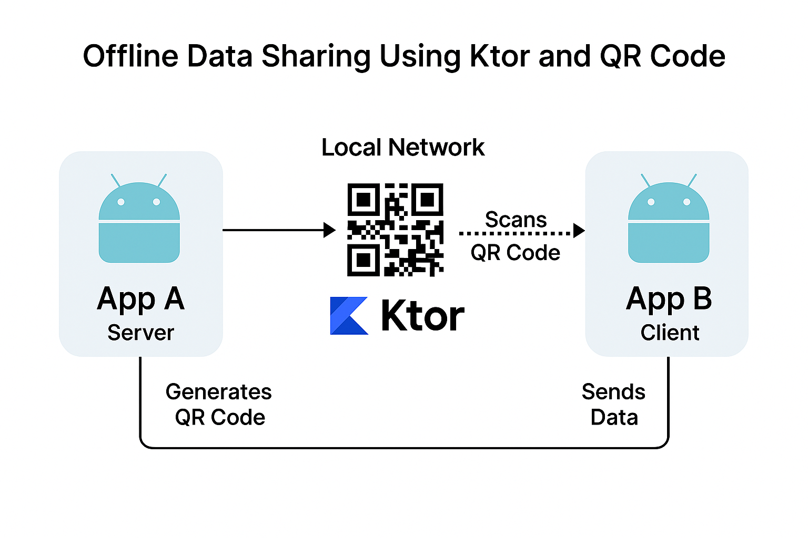
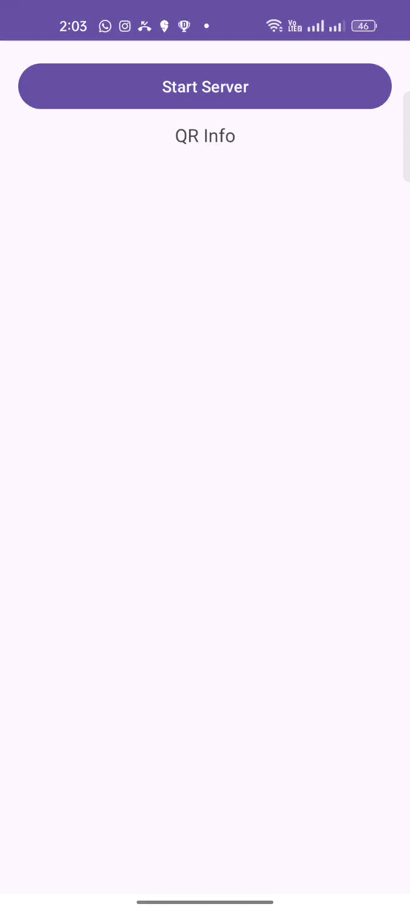
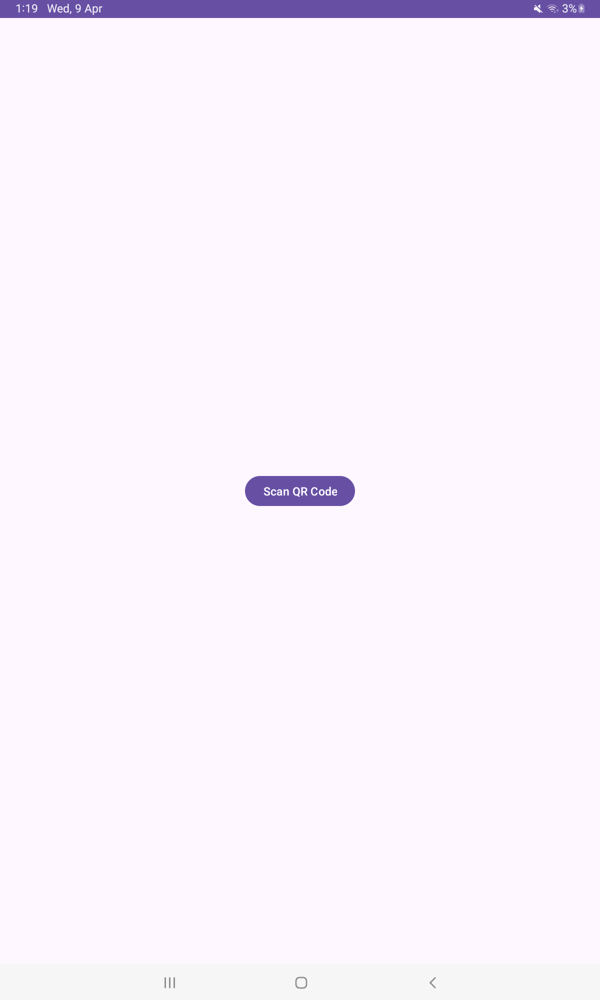

# 🔄 Offline Data Sharing Between Android Apps using Ktor and QR Code

This open-source Android project allows **offline, secure image transfer** between two Android apps (App A and App B) over a local network using **Ktor**, **QR codes**, and **token-based authentication**.

---

## 📱 Use Case

- **App A**: Acts as a **local Ktor server**, generates a **QR code** with IP, port, and token, and receives an image from the client.
- **App B**: Acts as a **client**, scans the QR, picks an image, converts it to **Base64** currently sharing only image for demo but we can able to send video and files also, and sends it to App A securely.

---

## 📦 Tech Stack

- **Kotlin**
- **Ktor (CIO Engine)**
- **Jetpack Lifecycle**
- **ZXing QR Scanner**
- **Base64 Image Encoding**
- **Modular MVVM Architecture**

---

## 🧱 Architecture Overview



---
## ✅ Features
- 🔌 Offline-first: No internet required

- 🔐 Secure by design: Token validation

- 🪶 Lightweight: Powered by Ktor CIO

- ♻️ Modular architecture: Easily extensible

- 📡 Peer-to-Peer support: Wi-Fi Direct, hotspot, or LAN

  ---
  ## 📦 Dependencies

Add the following to your **app-level `build.gradle.kts`** or `build.gradle`:

```kotlin
// Ktor Server (App A)
implementation("io.ktor:ktor-server-core:2.3.9")
implementation("io.ktor:ktor-server-cio:2.3.9")
implementation("io.ktor:ktor-server-content-negotiation:2.3.9")
implementation("io.ktor:ktor-serialization-kotlinx-json:2.3.9")

// Ktor Client (App B)
implementation("io.ktor:ktor-client-core:2.3.9")
implementation("io.ktor:ktor-client-cio:2.3.9")
implementation("io.ktor:ktor-client-content-negotiation:2.3.9")
implementation("io.ktor:ktor-serialization-kotlinx-json:2.3.9")

// Kotlinx Serialization
implementation("org.jetbrains.kotlinx:kotlinx-serialization-json:1.6.3")

// ZXing QR Code Scanner (App B)
implementation("com.journeyapps:zxing-android-embedded:4.3.0")
implementation("androidx.activity:activity-ktx:1.8.0")

// AndroidX Lifecycle
implementation("androidx.lifecycle:lifecycle-runtime-ktx:2.6.2")

// Kotlin Coroutines
implementation("org.jetbrains.kotlinx:kotlinx-coroutines-android:1.7.3")

// For Base64 image decoding
implementation("androidx.core:core-ktx:1.12.0")
```
-----
## 📸 QR Code Content
     ```Format:
      <IP Address>|<Port>|<Token>
      Example: 192.168.0.102|8080|my_secure_token
      ```


## 📂 Project Structure

- 📁 app-a-server/
 -┣📄 MainActivity.kt
 -┣📄 KtorServer.kt
 -┗📄 QrCodeGenerator.kt

- 📁 app-b-client/
 -┣📄 MainActivity.kt
 -┣📄 QrScanner.kt
 -┗ 📄 ImageSender.kt

  ---

## 📹 Demo APP A

  

Demo App B
  

## 🧪 How to Test
   1.Install App A and App B on two Android devices (same Wi-Fi or hotspot).

   2.Open App A → Tap Start Server → QR Code data (IP|Port|Token) is displayed.

   3.Open App B → Tap Scan QR → Scan QR code → Pick image from gallery.

   4.App B sends image → App A receives and displays it.

## 🤝 Let’s Connect!

- 💬 Have feedback or questions? Open an issue

- 🌐 Connect on GitHub or LinkedIn

- ⭐ Star this project if it helped you!

## 📧 Contact
   For any inquiries, feature requests, or issues, please open an issue in the repository or contact me at jaichandar14@gmail.com.


